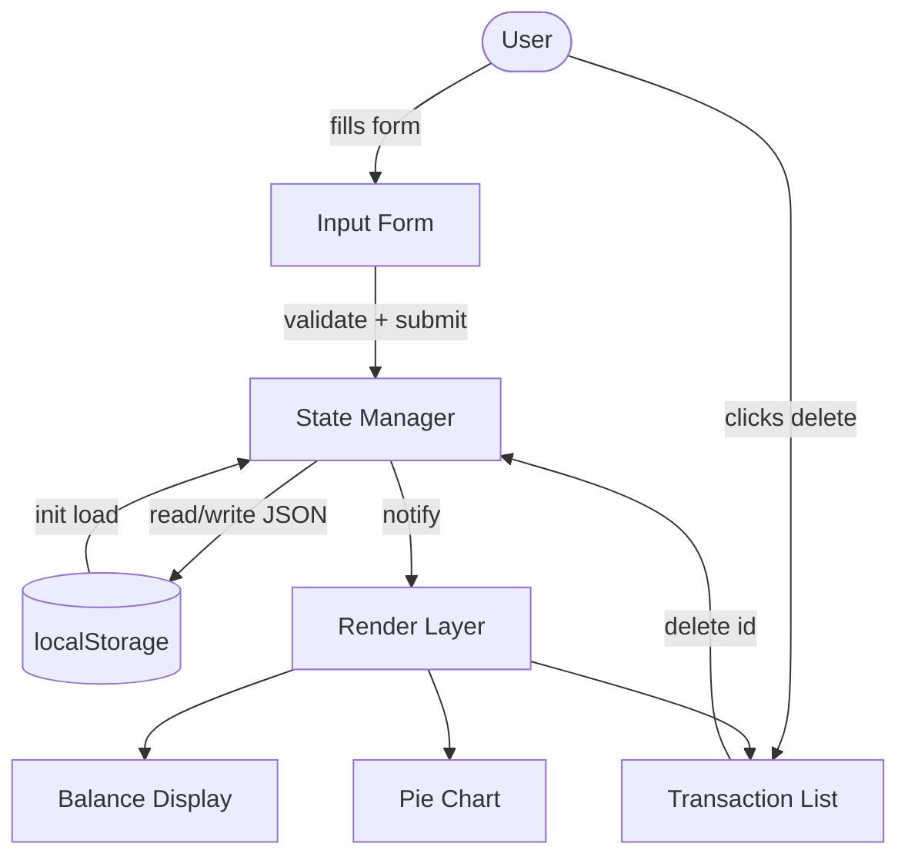
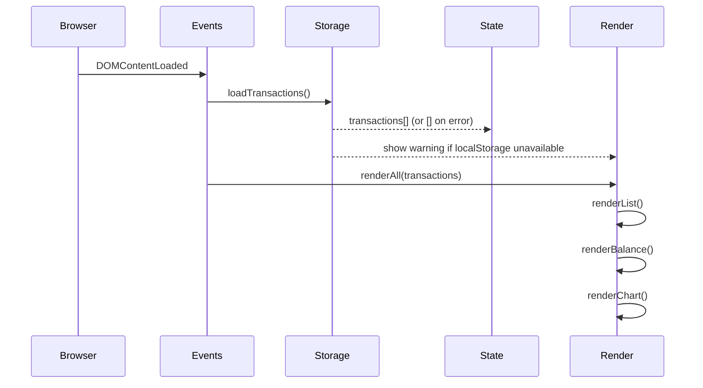

# Design Document: Expense & Budget Visualizer

## Overview

The Expense & Budget Visualizer is a self-contained, single-page client-side web application.
There is no backend — all state lives in the browser's `localStorage` and all rendering is done
with Vanilla JavaScript and the Chart.js library loaded from a CDN.

The architecture follows a **unidirectional data flow** pattern:

```
User Action → State Mutation (localStorage write) → UI Render (DOM + Chart.js sync)
```

Every UI element is derived from the canonical state array stored in `localStorage`. Renders are
never partial; after any mutation the three dependent views (transaction list, balance display,
pie chart) are always refreshed together to guarantee consistency without a framework's virtual DOM.

---

## Architecture

### High-Level Data Flow



### Module Responsibilities

The single JavaScript file (`js/app.js`) is organised into five logical sections, each clearly
delimited with a block comment. This keeps the file readable and within the 500-line limit.

| Section | Responsibility |
|---|---|
| **Config** | Constants: categories, localStorage key, amount limits |
| **Storage** | `loadTransactions()`, `saveTransactions(transactions)` — all localStorage I/O |
| **State** | In-memory `transactions[]` array, `addTransaction()`, `deleteTransaction()` |
| **Render** | `renderAll()`, `renderList()`, `renderBalance()`, `renderChart()` |
| **Events** | Form submit handler, delete event delegation, DOMContentLoaded init |

### Initialisation Sequence



---

## Components and Interfaces

### File and Folder Structure

```
expense-budget-visualizer/
├── index.html
├── css/
│   └── style.css
└── js/
    └── app.js
```

`index.html` loads Chart.js from the jsDelivr CDN and then `js/app.js` as a plain `<script>`
deferred to the end of `<body>`. No build step is required.

```html
<script src="https://cdn.jsdelivr.net/npm/chart.js@4.4.4/dist/chart.umd.min.js"></script>
<script src="js/app.js"></script>
```

### HTML Structure

```
<body>
  <div class="app-container">
    │
    ├── <header class="app-header">
    │     └── Balance Display
    │           <div id="balance-display">
    │             <span class="balance-label">Total Spent</span>
    │             <span id="balance-amount">0.00</span>
    │           </div>
    │
    ├── <main class="app-main">
    │     │
    │     ├── <section class="input-section">
    │     │     <form id="transaction-form">
    │     │       <div class="field-group">
    │     │         <label for="item-name">Item Name</label>
    │     │         <input id="item-name" type="text" maxlength="100" />
    │     │         <span class="field-error" id="item-name-error"></span>
    │     │       </div>
    │     │       <div class="field-group">
    │     │         <label for="amount">Amount</label>
    │     │         <input id="amount" type="number" min="0.01" max="999999999.99" step="0.01" />
    │     │         <span class="field-error" id="amount-error"></span>
    │     │       </div>
    │     │       <div class="field-group">
    │     │         <label for="category">Category</label>
    │     │         <select id="category">
    │     │           <option value="">-- Select --</option>
    │     │           <option value="Food">Food</option>
    │     │           <option value="Transport">Transport</option>
    │     │           <option value="Fun">Fun</option>
    │     │         </select>
    │     │         <span class="field-error" id="category-error"></span>
    │     │       </div>
    │     │       <button type="submit">Add Transaction</button>
    │     │     </form>
    │     │   </section>
    │     │
    │     ├── <section class="list-section">
    │     │     <h2>Transactions</h2>
    │     │     <div id="transaction-list">
    │     │       <!-- <p class="empty-state"> or <ul> rendered here -->
    │     │     </div>
    │     │   </section>
    │     │
    │     └── <section class="chart-section">
    │           <div id="chart-container">
    │             <!-- <canvas id="pie-chart"> or <p class="chart-empty"> -->
    │           </div>
    │         </section>
    │
    └── <div id="storage-warning" hidden>
          LocalStorage is unavailable — data will not be saved.
        </div>
  </div>
</body>
```

### JavaScript Public Interface (within app.js)

These are the key named functions. Because there is no module system, they are defined as
`const` arrow functions in a single IIFE scope to avoid polluting `window`.

```js
// Storage layer
loadTransactions()             → Transaction[] | []
saveTransactions(txns)         → void (silent on error)

// State mutations — each calls saveTransactions then renderAll
addTransaction(formData)       → void
deleteTransaction(id)          → void

// Render layer
renderAll(txns)                → void  (calls the three below)
renderList(txns)               → void
renderBalance(txns)            → void
renderChart(txns)              → void

// Validator (pure function — no side effects)
validate(itemName, amount, category) → { valid: boolean, errors: FieldErrors }

// Utilities
generateId()                   → string  (crypto.randomUUID or Date.now fallback)
formatAmount(n)                → string  ("1234.56")
groupByCategory(txns)          → { Food: number, Transport: number, Fun: number }
```

---

## Data Models

### Transaction Object (stored in localStorage)

```json
{
  "id":        "uuid-v4-string",
  "itemName":  "Coffee",
  "amount":    4.50,
  "category":  "Food",
  "timestamp": "2024-09-28T10:30:00.000Z"
}
```

| Field | Type | Constraints |
|---|---|---|
| `id` | `string` | UUID v4 via `crypto.randomUUID()` or `Date.now().toString(36) + Math.random().toString(36)` fallback |
| `itemName` | `string` | 1–100 non-whitespace characters |
| `amount` | `number` | 0.01 – 999,999,999.99 (stored as JS number, not string) |
| `category` | `"Food" \| "Transport" \| "Fun"` | One of the three enum values |
| `timestamp` | `string` | ISO 8601 UTC (`new Date().toISOString()`) |

### localStorage Schema

```
Key:   "ebv_transactions"
Value: JSON-serialised Transaction[]
```

A single key stores the entire array. On every mutation (add or delete) the full array is
re-serialised and written. This is safe at the scale of personal expense tracking (hundreds of
records) and avoids the complexity of per-record keys.

### In-Memory State

```js
let transactions = []; // canonical array, always sorted newest-first after mutations
```

This is the single source of truth during a session. It is always synchronised with localStorage.

### FieldErrors Object (validator return value)

```js
{
  itemName: string | null,   // error message or null if valid
  amount:   string | null,
  category: string | null
}
```

---

## Correctness Properties

*A property is a characteristic or behavior that should hold true across all valid executions of a
system — essentially, a formal statement about what the system should do. Properties serve as the
bridge between human-readable specifications and machine-verifiable correctness guarantees.*

### Property 1: Validator accepts all valid inputs

*For any* non-empty item name (trimmed length ≥ 1, ≤ 100), amount in the range [0.01, 999999999.99],
and category that is one of `{Food, Transport, Fun}`, the `validate()` function SHALL return
`{ valid: true }` with no field errors.

**Validates: Requirements 1.2**

---

### Property 2: Validator rejects all invalid inputs

*For any* input where the item name is empty or composed entirely of whitespace, or the amount is
outside [0.01, 999999999.99] (including NaN, 0, negative, or non-numeric), or the category is
not one of `{Food, Transport, Fun}`, the `validate()` function SHALL return `{ valid: false }`
and the corresponding field error(s) SHALL be non-null strings.

**Validates: Requirements 1.3**

---

### Property 3: Add transaction persists and is retrievable

*For any* valid transaction input, after `addTransaction()` completes, the transaction SHALL exist
in `localStorage` (when read back and JSON-parsed as a `Transaction[]`) and the transaction's
`id`, `itemName`, `amount`, `category`, and `timestamp` fields SHALL be present and correctly typed
(id: string, amount: number, timestamp: ISO 8601 string).

**Validates: Requirements 1.4, 5.2, 5.5**

---

### Property 4: Delete transaction removes it from storage and list

*For any* transaction that exists in the current state, after `deleteTransaction(id)` completes,
the transaction SHALL NOT be present in `localStorage` (by id) and SHALL NOT be present in the
rendered transaction list DOM (by `data-id` attribute).

**Validates: Requirements 2.4, 5.3**

---

### Property 5: Transaction list renders in reverse-chronological order

*For any* array of transactions with distinct ISO 8601 timestamps, `renderList()` SHALL produce
DOM list items in descending timestamp order, such that for any two adjacent rendered items,
the item appearing earlier in the DOM has a timestamp greater than or equal to the one following it.

**Validates: Requirements 2.1**

---

### Property 6: Transaction list items contain all required fields formatted correctly

*For any* transaction, the DOM element rendered by `renderList()` for that transaction SHALL
contain a text node matching `itemName`, a text node matching `amount` formatted to exactly 2
decimal places (e.g. `4.50`, not `4.5`), and a text node matching `category`.

**Validates: Requirements 2.2**

---

### Property 7: Balance equals sum of all transaction amounts

*For any* array of transactions (including arrays with some corrupted/non-numeric amount values),
`renderBalance()` SHALL display a string equal to the arithmetic sum of all numeric `amount`
values (treating non-numeric values as 0), formatted to exactly 2 decimal places.

**Validates: Requirements 3.2, 3.3, 3.4, 3.5, 3.6**

---

### Property 8: Chart data reflects per-category totals

*For any* array of transactions, the Chart.js dataset passed to `renderChart()` SHALL contain
exactly one data value per category that has at least one transaction, where each value equals
the sum of `amount` across all transactions of that category, and categories with zero transactions
SHALL NOT appear as segments.

**Validates: Requirements 4.1, 4.2, 4.3, 4.4**

---

### Property 9: App init populates UI from stored transactions

*For any* `Transaction[]` pre-populated in `localStorage` under the key `"ebv_transactions"`, after
the app's `init()` function runs, the rendered transaction list, balance display, and chart data
SHALL all reflect the stored transactions as if `renderAll()` had been called with that array.

**Validates: Requirements 5.1**

---

## Error Handling

### localStorage Unavailability

`loadTransactions()` and `saveTransactions()` are wrapped in `try/catch`. On any read error during
init, the app falls back to `transactions = []` and makes the `#storage-warning` element visible.
On any write error during add/delete, the in-memory state still mutates and the UI still updates —
the user is not interrupted but the warning is shown.

```js
function loadTransactions() {
  try {
    const raw = localStorage.getItem(STORAGE_KEY);
    return raw ? JSON.parse(raw) : [];
  } catch {
    showStorageWarning();
    return [];
  }
}
```

### Corrupted Amount Data

`renderBalance()` and `groupByCategory()` both use `Number(txn.amount)` and check `isNaN()`.
Corrupted amounts resolve to `0` and do not throw.

### Form Validation Errors

The `validate()` function returns a structured `FieldErrors` object. The event handler iterates
over the error object's keys and populates the adjacent `<span class="field-error">` element.
Error elements are cleared at the start of every submission attempt.

### Chart.js Instance Management

A module-level `let chartInstance = null` variable tracks the live Chart.js instance.
Before any re-render, if `chartInstance` is not null, `chartInstance.destroy()` is called.
This prevents the "canvas already in use" error that Chart.js throws when re-using a canvas.

```js
function renderChart(txns) {
  if (chartInstance) { chartInstance.destroy(); chartInstance = null; }
  const canvas = document.getElementById('pie-chart');
  if (txns.length === 0) { /* show placeholder, hide canvas */ return; }
  chartInstance = new Chart(canvas, { type: 'pie', data: buildChartData(txns), options: CHART_OPTIONS });
}
```

---

## Testing Strategy

### Unit Tests (example-based)

Unit tests should be written for the pure/logic functions using a lightweight runner such as
the browser's built-in `console.assert` or Jasmine/Jest if a test harness is acceptable.

Focus areas:
- `validate()`: specific valid examples; specific invalid examples for each field
- `formatAmount()`: `4.5 → "4.50"`, `0 → "0.00"`, `1000000 → "1000000.00"`
- `groupByCategory()`: empty array, single category, all three categories
- `generateId()`: returns a non-empty string on every call
- Empty-state rendering: transaction list empty message; chart placeholder

### Property-Based Tests (using fast-check)

The property tests use [fast-check](https://github.com/dubzzz/fast-check), a property-based
testing library for JavaScript/TypeScript. Each test is configured to run a minimum of 100
iterations.

Each test is tagged with a comment:
```js
// Feature: expense-budget-visualizer, Property {n}: {property_text}
```

**Property 1 — Validator accepts all valid inputs**
```
// Feature: expense-budget-visualizer, Property 1: Validator accepts all valid inputs
fc.assert(fc.property(
  fc.string({ minLength: 1, maxLength: 100 }).filter(s => s.trim().length > 0),
  fc.float({ min: 0.01, max: 999999999.99 }),
  fc.constantFrom('Food', 'Transport', 'Fun'),
  (name, amount, category) => validate(name, amount, category).valid === true
), { numRuns: 100 });
```

**Property 2 — Validator rejects all invalid inputs**
```
// Feature: expense-budget-visualizer, Property 2: Validator rejects all invalid inputs
fc.assert(fc.property(
  fc.oneof(
    fc.constant(''),
    fc.string().map(s => s.replace(/\S/g, ' ')),   // whitespace-only
    fc.record({ name: fc.string({ minLength: 1 }), amount: fc.oneof(fc.constant(0), fc.constant(-1), fc.constant(NaN)), category: fc.constantFrom('Food', 'Transport', 'Fun') })
  ),
  (invalidInput) => validate(invalidInput).valid === false
), { numRuns: 100 });
```

**Property 3 — Add transaction persists and is retrievable**
```
// Feature: expense-budget-visualizer, Property 3: Add transaction persists and is retrievable
// Uses a mock localStorage (in-memory Map) to isolate from browser API.
```

**Property 5 — Transaction list renders in reverse-chronological order**
```
// Feature: expense-budget-visualizer, Property 5: Transaction list renders in reverse-chronological order
fc.assert(fc.property(
  fc.array(arbitraryTransaction(), { minLength: 2, maxLength: 20 }),
  (txns) => {
    const sorted = sortDescByTimestamp(txns);
    const rendered = getRenderedIds();
    return sorted.every((t, i) => rendered[i] === t.id);
  }
), { numRuns: 100 });
```

**Property 6 — List items contain all required fields**
```
// Feature: expense-budget-visualizer, Property 6: Transaction list items contain all required fields formatted correctly
```

**Property 7 — Balance equals sum of amounts**
```
// Feature: expense-budget-visualizer, Property 7: Balance equals sum of all transaction amounts
fc.assert(fc.property(
  fc.array(arbitraryTransaction(), { maxLength: 50 }),
  (txns) => {
    const expected = txns.reduce((acc, t) => acc + (isNaN(Number(t.amount)) ? 0 : Number(t.amount)), 0);
    return computeBalance(txns) === expected.toFixed(2);
  }
), { numRuns: 100 });
```

**Property 8 — Chart data reflects per-category totals**
```
// Feature: expense-budget-visualizer, Property 8: Chart data reflects per-category totals
fc.assert(fc.property(
  fc.array(arbitraryTransaction(), { maxLength: 50 }),
  (txns) => {
    const groups = groupByCategory(txns);
    const chartData = buildChartData(txns);
    return chartData.datasets[0].data.every((val, i) => val === groups[chartData.labels[i]]);
  }
), { numRuns: 100 });
```

**Property 9 — App init populates UI from stored transactions**
```
// Feature: expense-budget-visualizer, Property 9: App init populates UI from stored transactions
// Seeds mock localStorage, calls init(), then compares rendered state to seed data.
```

### Integration / Smoke Tests

- **LocalStorage unavailability**: Stub `localStorage.getItem` to throw; verify `#storage-warning` is visible.
- **Chart.js canvas reuse**: Add, then delete transactions repeatedly; verify no console errors about canvas reuse.
- **Responsive layout**: Manual visual check at 320px, 768px, 1280px, 1920px viewport widths.
- **100ms interaction budget**: DevTools Performance tab or `performance.now()` before/after form submit.

---

## CSS Architecture and Visual Design

### Layout Strategy

A single-column layout on narrow viewports transitions to a two-column layout (form + list side by
side, chart below or beside) at the `md` breakpoint (≥ 768px) using CSS Grid.

```css
/* Mobile-first base */
.app-main {
  display: grid;
  grid-template-columns: 1fr;
  gap: 1.5rem;
}

/* ≥ 768px: form left, list right */
@media (min-width: 768px) {
  .app-main {
    grid-template-columns: 1fr 1fr;
    grid-template-areas:
      "input  list"
      "chart  chart";
  }
}

/* ≥ 1280px: three columns */
@media (min-width: 1280px) {
  .app-main {
    grid-template-columns: 1fr 1fr 1fr;
    grid-template-areas: "input list chart";
  }
}
```

### Scrollable Transaction List

```css
#transaction-list {
  max-height: 400px;
  overflow-y: auto;
}
```

### Design Tokens (CSS Custom Properties)

```css
:root {
  --color-food:      #FF6384;
  --color-transport: #36A2EB;
  --color-fun:       #FFCE56;
  --color-bg:        #f9fafb;
  --color-surface:   #ffffff;
  --color-text:      #111827;
  --color-text-mute: #6b7280;
  --color-error:     #dc2626;
  --radius:          0.5rem;
  --shadow:          0 1px 3px rgba(0,0,0,0.12);
}
```

Category colours are reused in both the CSS (category badge chips) and passed as `backgroundColor`
in the Chart.js dataset config so the legend colours match the UI.

### Accessibility

- All form fields have explicit `<label for="...">` associations.
- Error messages use `role="alert"` on the `.field-error` span so screen readers announce them.
- The balance amount uses `aria-live="polite"` so updates are announced without interrupting.
- Delete buttons have an `aria-label="Delete [item name]"` to distinguish them from each other.
- Colour is not the only indicator — category badges also show the category name text.

---

## Chart.js Integration Details

**CDN**: `https://cdn.jsdelivr.net/npm/chart.js@4.4.4/dist/chart.umd.min.js`

**Chart configuration**:

```js
const CHART_OPTIONS = {
  responsive: true,
  plugins: {
    legend: {
      display: true,
      position: 'bottom',
    },
    tooltip: {
      callbacks: {
        label: (ctx) => ` ${ctx.label}: $${ctx.parsed.toFixed(2)} (${ctx.formattedValue}%)`
      }
    }
  }
};

const CATEGORY_COLORS = {
  Food:      '#FF6384',
  Transport: '#36A2EB',
  Fun:       '#FFCE56',
};

function buildChartData(txns) {
  const groups = groupByCategory(txns);
  const labels = Object.keys(groups).filter(k => groups[k] > 0);
  return {
    labels,
    datasets: [{
      data:            labels.map(l => groups[l]),
      backgroundColor: labels.map(l => CATEGORY_COLORS[l]),
    }]
  };
}
```

**Update strategy**: destroy + recreate on every `renderChart()` call. This is the recommended
pattern for Chart.js v4 when dataset labels change (e.g. a category is fully removed). For this
app's scale (≤ hundreds of entries) the overhead is negligible and far simpler than the
incremental update API.

**Placeholder state**: when `txns.length === 0` the `<canvas>` is hidden with `display:none` and
a sibling `<p class="chart-empty">` is made visible. This avoids rendering an empty chart.

---

## Design Decisions and Rationales

| Decision | Rationale |
|---|---|
| Single localStorage key for entire array | Simplicity; personal tracker scale never approaches the 5MB limit |
| Destroy-and-recreate Chart.js instance | Handles label changes (category removal) cleanly; simpler than incremental update for this scale |
| No module bundler / import maps | Requirements mandate a single JS file deliverable without a build step |
| IIFE scope for app.js | Prevents global namespace pollution without needing ES modules |
| Render-all on every mutation | Guarantees consistency between list, balance, and chart; negligible cost at this scale |
| Write to localStorage before UI update | Ensures data durability even if the render throws an error |
| `crypto.randomUUID()` with fallback | Available in all modern browsers; fallback handles older extension environments |
| CSS Grid with mobile-first breakpoints | Covers 320px–1920px requirement cleanly with two breakpoints |
